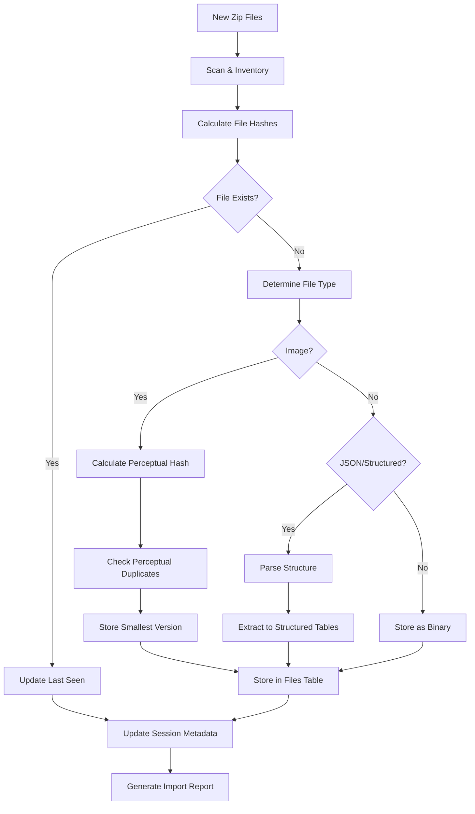
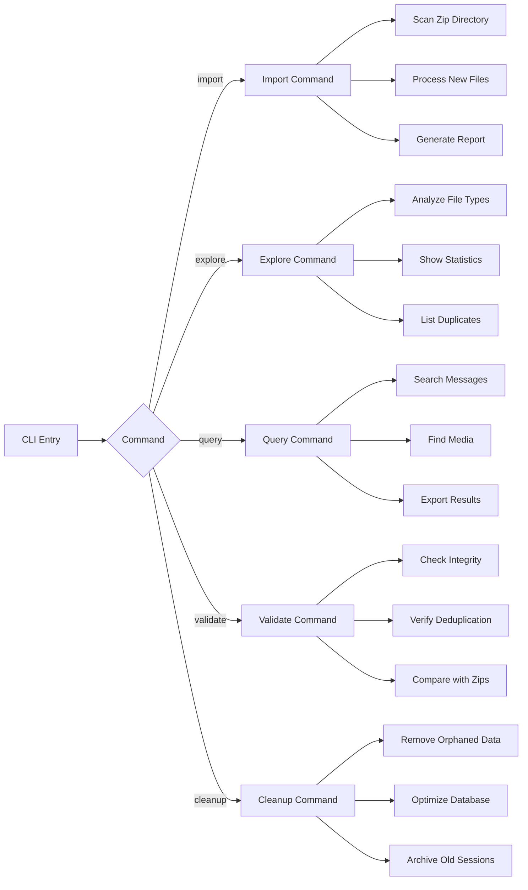

# Meta Takeout Database Migration Plan

## Overview

This tool will migrate Facebook export zip files into a structured DuckDB database with intelligent deduplication, enabling efficient storage and querying while supporting incremental imports of future exports.

## Current State Analysis

Based on existing code exploration, we have:
- **Perceptual image hashing** for detecting visually similar images across exports
- **Space analysis** showing significant duplication between zip files
- **Extraction utilities** for processing zip contents
- **File type detection** for images and structured data

## Database Schema Design

### Core Tables

```sql
-- Track ingestion sessions
CREATE TABLE ingestion_sessions (
    id UUID PRIMARY KEY,
    zip_path TEXT NOT NULL,
    zip_filename TEXT NOT NULL,
    ingested_at TIMESTAMP DEFAULT CURRENT_TIMESTAMP,
    file_count INTEGER,
    total_bytes BIGINT
);

-- File registry with deduplication
CREATE TABLE files (
    id UUID PRIMARY KEY,
    path_in_export TEXT NOT NULL,
    content_hash BLOB NOT NULL,
    perceptual_hash TEXT, -- For images
    file_extension TEXT,
    content_type TEXT,
    original_size BIGINT,
    compressed_size BIGINT,
    first_seen_session UUID REFERENCES ingestion_sessions(id),
    last_seen_session UUID REFERENCES ingestion_sessions(id),
    canonical_content BLOB, -- Smallest/best version
    UNIQUE(content_hash)
);

-- Track which files appeared in which sessions
CREATE TABLE file_appearances (
    file_id UUID REFERENCES files(id),
    session_id UUID REFERENCES ingestion_sessions(id),
    compressed_size BIGINT,
    PRIMARY KEY(file_id, session_id)
);

-- Structured message data
CREATE TABLE messages (
    id UUID PRIMARY KEY,
    conversation_id TEXT,
    sender_name TEXT,
    timestamp_ms BIGINT,
    content TEXT,
    message_type TEXT,
    source_file_id UUID REFERENCES files(id),
    source_session_id UUID REFERENCES ingestion_sessions(id)
);

-- Media attachments
CREATE TABLE media_attachments (
    id UUID PRIMARY KEY,
    message_id UUID REFERENCES messages(id),
    file_id UUID REFERENCES files(id),
    attachment_type TEXT,
    filename TEXT
);
```

## Processing Pipeline



## CLI Architecture



## Implementation Phases

### Phase 1: Core Infrastructure
- [ ] Database schema implementation
- [ ] Basic file ingestion pipeline
- [ ] Content hashing and deduplication
- [ ] CLI framework with import command

### Phase 2: Image Processing
- [ ] Integrate perceptual hashing from existing code
- [ ] Image deduplication logic
- [ ] Size-based selection for canonical versions
- [ ] Image metadata extraction

### Phase 3: Structured Data
- [ ] JSON conversation parser
- [ ] Message extraction to structured tables
- [ ] Media attachment linking
- [ ] Contact/profile data extraction

### Phase 4: Advanced Features
- [ ] Incremental import optimization
- [ ] Search and query capabilities
- [ ] Export functionality
- [ ] Validation and integrity checking

### Phase 5: Production Ready
- [ ] Comprehensive testing
- [ ] Performance optimization
- [ ] Documentation
- [ ] Safe cleanup verification

## File Type Discovery

Create an exploration utility to analyze current zip contents:

```rust
// examples/analyze_file_types.rs
async fn analyze_zip_contents() -> Result<()> {
    let mut type_map: HashMap<String, (u64, u64)> = HashMap::new(); // (count, total_bytes)
    
    // Scan all zips and categorize files
    for zip_path in get_zip_files()? {
        let archive = open_zip(&zip_path).await?;
        for entry in archive.entries() {
            let extension = get_extension(&entry.name());
            let count_bytes = &mut type_map.entry(extension).or_default();
            count_bytes.0 += 1;
            count_bytes.1 += entry.compressed_size;
        }
    }
    
    // Report findings
    for (ext, (count, bytes)) in type_map {
        println!("{}: {} files, {}", ext, count, format_bytes(bytes));
    }
}
```

## Deduplication Strategy

### Content-Based Deduplication
1. **SHA-256 hashing** for exact duplicate detection
2. **Perceptual hashing** for visually similar images
3. **Size-based selection** for keeping the smallest/best version
4. **Metadata preservation** to track all sources

### Structured Data Deduplication
1. **Message-level deduplication** based on timestamp + content + sender
2. **Conversation threading** to handle partial vs complete exports
3. **Incremental updates** for new messages in existing conversations
4. **Schema evolution** handling for Facebook export format changes

## Validation & Safety

### Pre-Cleanup Validation
```rust
async fn validate_migration_completeness() -> Result<()> {
    // 1. Verify all files from zips are in database
    // 2. Validate perceptual hash accuracy on sample
    // 3. Check structured data extraction completeness
    // 4. Confirm no data corruption during processing
    // 5. Generate detailed migration report
}
```

### Incremental Validation
- Compare new import results with previous sessions
- Detect unexpected data changes or corruption
- Verify deduplication accuracy
- Monitor database size vs zip file savings

## CLI Commands

```bash
# Initial migration
meta-takeout import --db ./facebook.duckdb --zips ./export-zips/ --scan-only
meta-takeout import --db ./facebook.duckdb --zips ./export-zips/ --execute

# Ongoing imports
meta-takeout import --db ./facebook.duckdb --zips ./new-exports/

# Exploration and analysis
meta-takeout explore --db ./facebook.duckdb --file-types
meta-takeout explore --db ./facebook.duckdb --duplicates
meta-takeout explore --db ./facebook.duckdb --conversations

# Querying
meta-takeout query --db ./facebook.duckdb --messages "keyword search"
meta-takeout query --db ./facebook.duckdb --media --type image
meta-takeout query --db ./facebook.duckdb --export ./my-data/

# Validation before cleanup
meta-takeout validate --db ./facebook.duckdb --zips ./export-zips/
meta-takeout validate --db ./facebook.duckdb --integrity

# Safe cleanup assistance
meta-takeout cleanup --db ./facebook.duckdb --suggest-removable
```

## Success Criteria

1. **Space Efficiency**: Database size < 50% of original zip files
2. **Data Integrity**: 100% validation against source files
3. **Query Performance**: Sub-second response for common searches
4. **Incremental Import**: New exports processed in < 5 minutes
5. **Safe Migration**: Zero data loss with full audit trail

## Risk Mitigation

- **Backup Strategy**: Always maintain original zips until validation complete
- **Rollback Capability**: Track all transformations for potential reversal
- **Incremental Approach**: Process one zip at a time with validation
- **Checksum Verification**: Continuous integrity checking
- **Export Capability**: Ability to reconstruct original data if needed

The end goal is a system where you can confidently delete the original zip files knowing that all data is preserved, efficiently stored, easily searchable, and ready for future incremental updates.